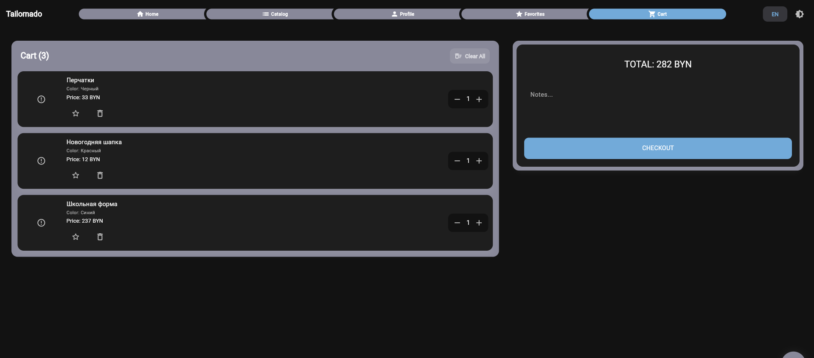
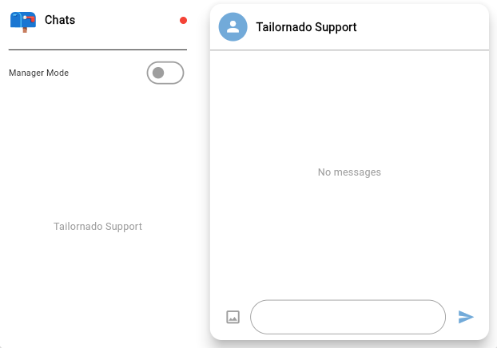
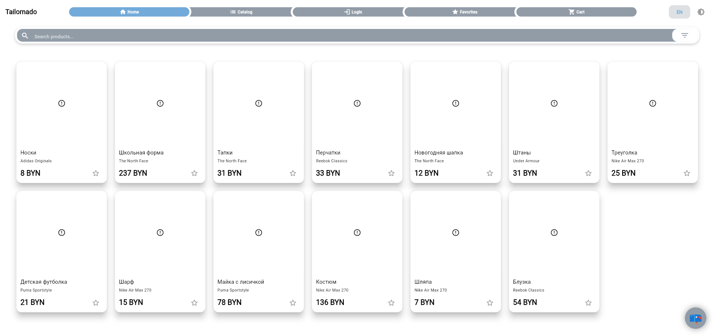
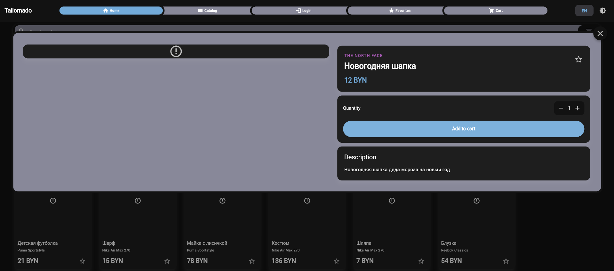
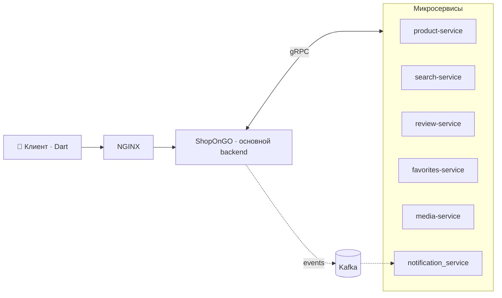

<div align="center">

# 🧵 Tailornado

### Интернет-магазин одежды на микросервисной архитектуре

**Go · gRPC · Kafka · PostgreSQL · Elasticsearch · Docker**

<!-- Замени на свою картинку: положи файл в .github/profile/ и укажи путь -->
<!--  -->

</div>

---

## О проекте

**Tailornado** — интернет-магазин одежды. Backend написан на **Go** и разбит на независимые микросервисы, которые общаются друг с другом по **gRPC** и через шину событий на **Kafka**. Клиентская часть — мобильное/веб-приложение на **Dart**.

Проект создан как полноценный «боевой» стартап-стек: авторизация, поиск, медиа, отзывы, избранное, уведомления, админ-панель и чат.

## 📸 Скриншоты

<p align="center">
  
</p>

<p align="center">
  
</p>

<!-- Раскомментируй, когда в стенде заработают картинки товаров:
<p align="center">
  
  
</p>
-->

🔗 **Демо:** _добавь ссылку, если проект где-то задеплоен_  
📄 **API:** [документация](https://drive.google.com/file/d/1057l-up2nKAML1gSnxQFe91tPad1152u/view?usp=sharing)  
🗄 **Схема БД:** [диаграмма на dbdiagram.io](https://dbdiagram.io/d/67e14f9975d75cc8443d6fe0)

---

## ✨ Возможности

- 🔐 Авторизация: **JWT + Refresh-токены**, вход через **OAuth2**
- 👥 Роли пользователей с разным набором действий
- 🛍 Каталог товаров и карточки продуктов
- 🔎 Полнотекстовый поиск на **Elasticsearch**
- ⭐ Отзывы и рейтинги
- ❤️ Избранное
- 🖼 Загрузка и хранение медиа
- 📬 Email-уведомления (**SMTP**) через **Kafka**
- 💬 Чат в реальном времени на **WebSocket** _(beta)_
- 🧩 **GraphQL** для гибких запросов
- 🛠 Админ-панель

---

## 🏗 Архитектура



> Паттерн **Pub/Sub** (`eventbus`) для событий между сервисами и **3-слойная архитектура** внутри каждого: `handler` (REST, валидация) → `service` (бизнес-логика) → `repository` (работа с БД).

---

## 📦 Репозитории

| Репозиторий | Описание |
|---|---|
| [**ShopOnGO**](https://github.com/ShopOnGO/ShopOnGO) | Основной backend (Go, Gin + Gorilla Mux) |
| [**ShopOnGOFrontend**](https://github.com/ShopOnGO/ShopOnGOFrontend) | Клиентское приложение (Dart) |
| [**shop_adminPanel**](https://github.com/ShopOnGO/shop_adminPanel) | Админ-панель |
| [**product-service**](https://github.com/ShopOnGO/product-service) | Микросервис продуктов |
| [**search-service**](https://github.com/ShopOnGO/search-service) | Микросервис поиска |
| [**review-service**](https://github.com/ShopOnGO/review-service) | Микросервис отзывов |
| [**favorites-service**](https://github.com/ShopOnGO/favorites-service) | Микросервис избранного |
| [**media-service**](https://github.com/ShopOnGO/media-service) | Микросервис медиа |
| [**notification_service**](https://github.com/ShopOnGO/notification_service) | Уведомления через Kafka |
| [**product-proto**](https://github.com/ShopOnGO/product-proto) · [**review-proto**](https://github.com/ShopOnGO/review-proto) · [**admin-proto**](https://github.com/ShopOnGO/admin-proto) | gRPC-контракты (protobuf) |
| [**Test-service**](https://github.com/ShopOnGO/Test-service) | Полный запуск всего приложения одной командой для тестирования |

---

## 🧰 Технологии


---

Самый простой способ поднять всё приложение — репозиторий [**Test-service**](https://github.com/ShopOnGO/Test-service):

```bash
git clone https://github.com/ShopOnGO/Test-service.git
cd Test-service
docker compose up --build
```

---

## 📬 Контакты

- Авторы: Ильинчик Даниил, Лукашов Егор.
- Email: danyailyinchyk2005@gmail.com
- Telegram: @LordVillainFury
